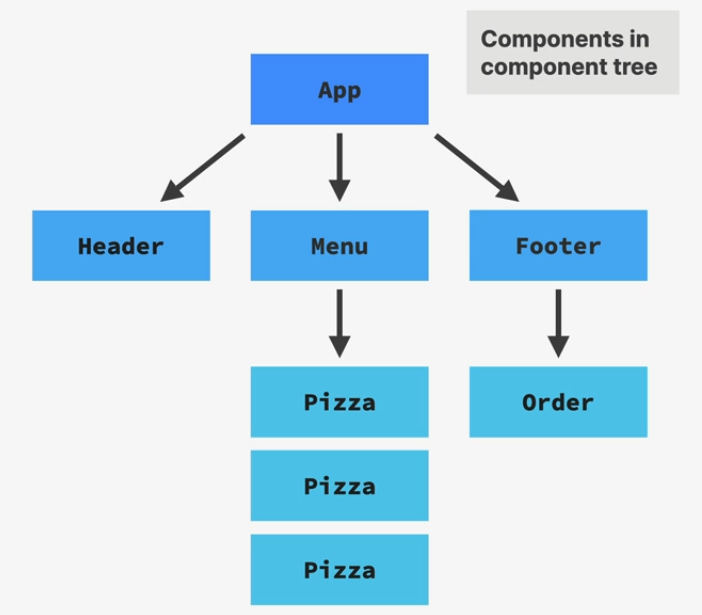

> # TABLE OF CONTENTS

- COMPONENTS
- JSX
- PROPS concept, destructuring props

> ## COMPONENTS

- Building blocks of UI in react

- Components are JS function that returns `JSX`.

- Components returns `only one` element.

- Component name must start with `capital letter`
- Components can be reuse by calling it multiple times. It can also be nested inside another components

- Write `Javascript` in component before `return` keyword in react component.

- Make file name Cap

- Component can return multiple return using condition (Conditionally redering component)

  ```jsx
  export default funciton App() {

      if(/* condition */){
          return (
              <p>This will return when if statement condition becomes true.</p>
          )
      }

      return (
          <p>I will display if if statement becomes false</p>
      )
  }

  /* Useful in API fetching. Example we can show loading... if data is not fetched or show if there any error occur during fetching */

  ```

- According to component tree, `the component above the component are parent component and below are child components`. For example, App is the parent component of Header, Menu & Footer component. Footer is parent for Order component and Order is child component of Footer component.
  

> ## JSX

- JSX is `Javascript + HTML`. You can also write `CSS` in JSX.

- Use `{ }` to write javascript inside JSX.

- Write `CSS` properties in `camelCase` (eg. backgroundColor instead of background-color). And values are `strings`.

- To write **CSS**. Use double `{{ }}` for styling as **one for to start JS and another for object**(As JSX accepts styling in object form). Example `<h1> style={{ color:"red", fontSize:"32px"  }} </h1>`

- Use `className` instead of class (As class is reserved keyword in javascript).

- JSX must have `only one parent element`. You should always wrap everything inside one parent element Or you can use react fragments `<> </>` where we can have multiple element and is not visible without using one single parent element.
  - Sometime we can also use react fragment to render a list then we can use like this : `<React.Fragment key={index} ></React.Fragment>`

- Boolean value `true or false` do not get rendered in JSX.

  ```jsx
  function App() {
    const age = 17;
    return (
      <p>
        {age >= 18 && "Adult"}
        {age < 18 && "Not Adult"}
      </p>
    );
  }
  {
    /* Here for 1st condition, output is false and it's boolean so it won't rendered. For 2nd expression, output is true so right part of the get's rendered. */
  }
  ```

> ## COMPONENT (INSTANCE) LIFECYCLE

__MOUNT/INITIAL RENDER &rarr; RE-RENDER(OPTIONAL) &rarr; UNMOUNT__

- Mount &rarr; When component instance is rendered for the first time. Fresh state or props are created.

- Re-render &rarr; When state changes, Props changes, Parent re-renders, context changes

- Unmount : Component instance is destroyed or removed. When state and props are destroyed.

> ## END
