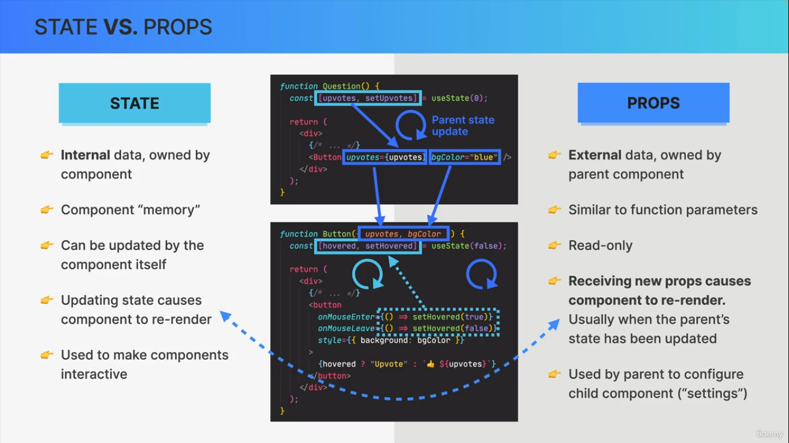

> # TABLE OF CONTENTS

- FORM
- CONTROLLED ELEMENTS

> ## FORM

- For form use normal HTML element.

  ```jsx
  function App(){

      function handleSubmit(e){
        // Accept event object
          console.log(e);
          e.preventDefault(); /* Stops normal HTML page refresh behaviour when from get's submitted. */
      }

        /* Form get's submitted as soon as user hit enter from any of form input field, as we have onSubmit in form element. We can add eventListener on this button also but we have to click this button to submit form. */
      return(
          <form onSubmit={handleSubmit} >
              <input type="text" placeholder="Enter anything" >
              <br/>
              <button>Submit</submit>
          </form>
      )
  }
  ```

> ## CONTROLLED ELEMENTS

- Make react take control of form element(Controlled Element)

  ```jsx
  import { useState } from "react";

  export default function App() {
    // Step 1 : Create state for that element
    const [search, setSearch] = useState("");

    function handleSubmit(e) {
      e.preventDefault();
      // console.log(e);
      const searchQuery = search;
      console.log(searchQuery);
      // set state to initial state or reset
      setSearch("");
    }
    /* Step 2: Add state to that element using value. Add then add eventListener to it which receives event and we read that event
  
    When we add value={state} react takes control of the element and DOM is no longer incharge of it.
  
    e.target.value is always string. So we might need to convert in case of working with number. And we can do using Number(e.target.value) or +e.target.value
   */
    return (
      <form onClick={handleSubmit}>
        <input
          type="text"
          placeholder="Search..."
          value={search}
          onChange={(e) => setSearch(e.target.value)}
        />
        <button>Submit</button>
      </form>
    );
  }
  ```

> ## TRICKS and More (OPTIONAL)

```js
// USEFUL in select option element where we have to display many number or somthing similar like DOB
Array.from({ length: 20 }, (_, i) => i + 1);
/* Array constructor to create array. from takes two arguments: object(like length) and function. In above function receives first argument as current value and second index
 */
```



> ## End
