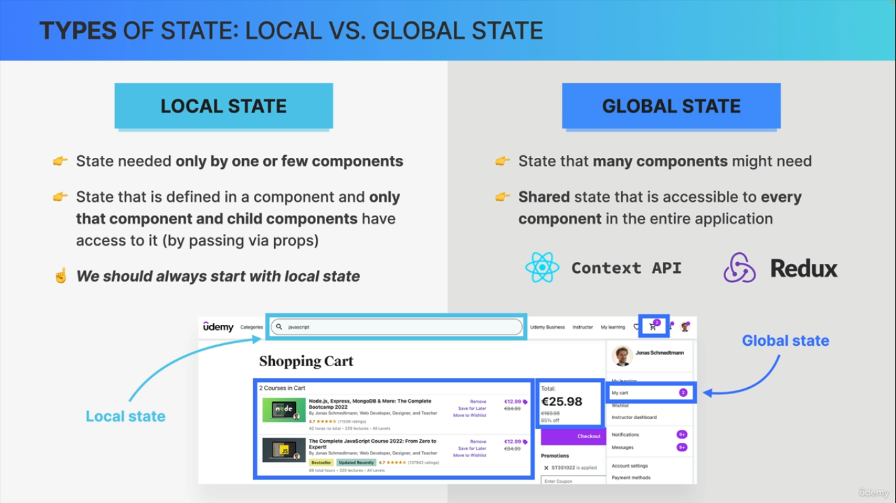
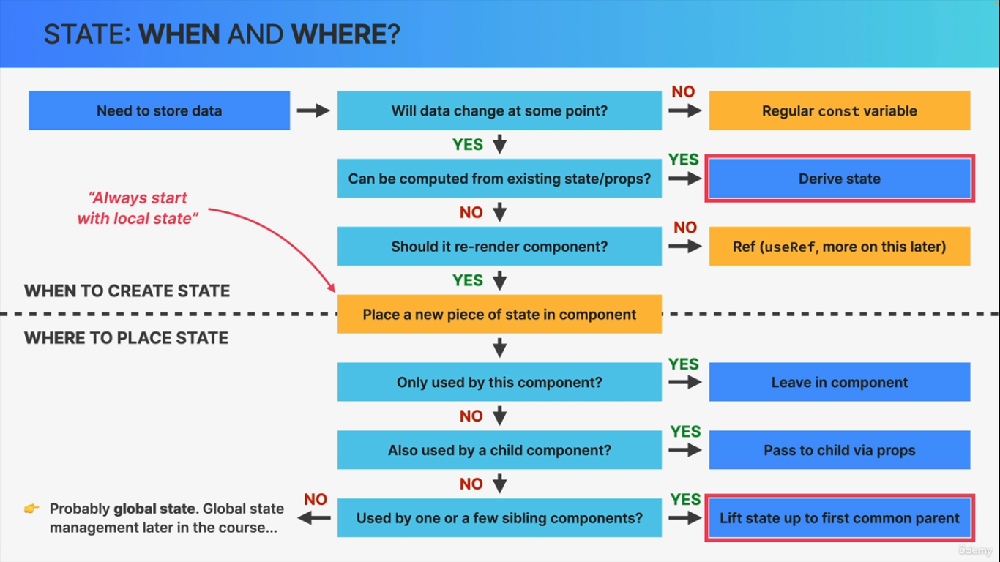
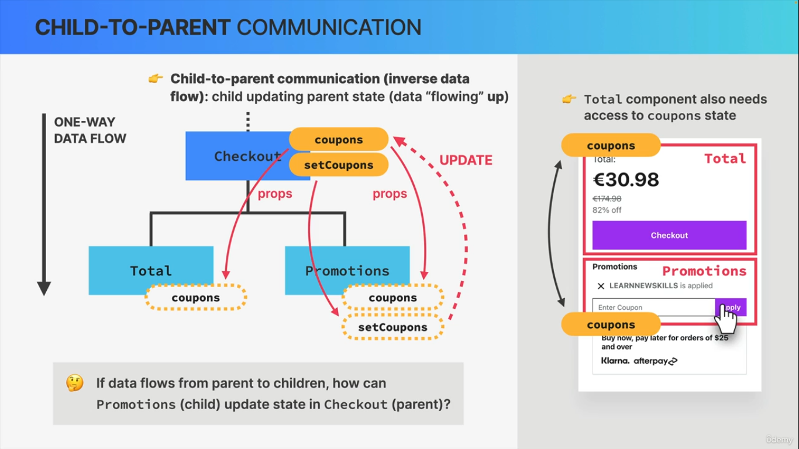
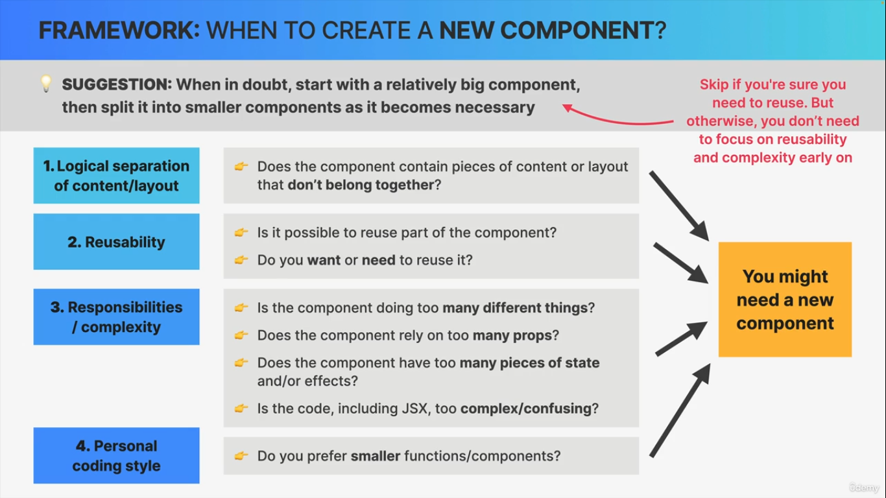

> # TABLE OF CONTENTS

- Thinking in react
  - State management
  - When and where to create state
- Lifting up state
- Derived state

> ## THINKING IN REACT

- Local vs Global STATE
  

- When and Where to use STATE
  

> ## LIFTING UP STATE

- Whenever multiple sibling components need access to the same state, we move that state up to the first common parent component and from parent we pass those state as a props to child components and this is known as `lifting up state`.
  

> ## DERIVED STATE

- Derived state is state that is computed form an existing piece of state or from props.
  - Example : Suppose a state that has products. If we calculate the total no. of product from that product state then such state is derived state.

    ```jsx
    import {useState} from "react";

    function App(){
      const [product,setProduct]=useState([{name:"a"},{name:"b"}])
      const total = product.lenght(); // Total is derived state
      return (
        <p>total products {total}</>
      )
    }
    ```

> ## Conclusion

- Split the UI into multiple smaller, resuable components.
  - Break into smaller components if components does too many things/responsiblities.
  - Break those that need too many props.
  - Those which are hard to reuse.
  - Complex code, hard to understand.
  - _Also don't make too many mini components_
  - **We can split UI based on below criteria**
    - Logical separation of content/layout
    - Resuablity
    - Responsibilities/complexity
  - 

- First make static version, then make it dynamic using state, props etc

- Decide whether the state gonna be needed to share with sibling state or not, if yes then lift the state to the nearest common parent component and then pass those state as props to child components which need it.

- If we want our component to run independently then we must define state within state. No lifting up state is needed.

> ## END
