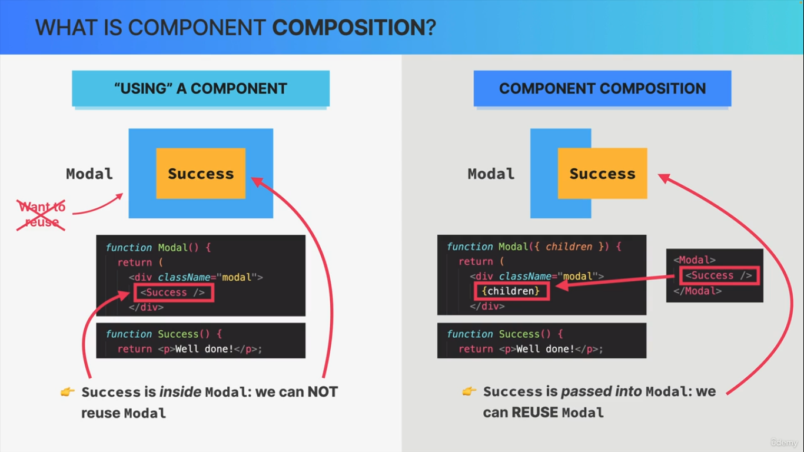
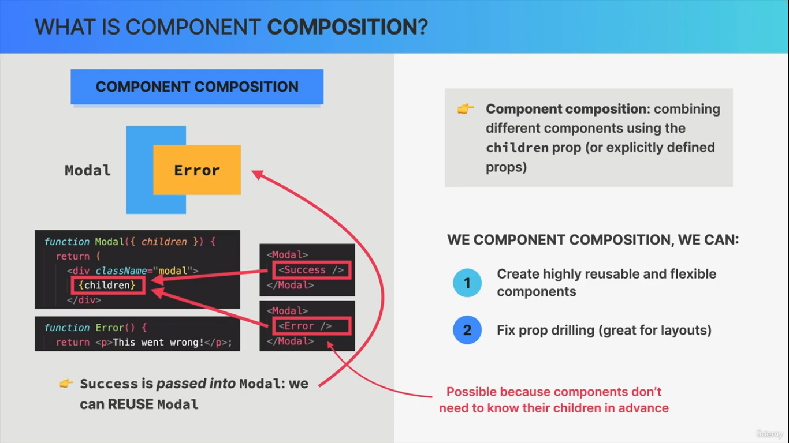

> # TABLE OF CONTENTS

- PROPS DRILLING
- SOLVING PROPS DRILLING PROBLEM USING COMPONENT COMPOSITION

> ## PROPS DRILLING

- Occurs when we need to pass props down to many nested child components. Any many of those components do not needed that props. This result in a lot of props to those child components _(which do not need that props at all)_ to pass that props to that final chld that need. It can become very problematic if child that need that props is nested very deep.

> ## COMPONENT COMPOSITION

- Combining different components using the children prop (or explicitly definded props). Example
  
  

- Props drilling can be solved/fixed using component composition.

- It can be used to create reusable component.

> ## Alternative to children

- We can pass element as props as well.

> ## End
