> # HOW REACT WORKS BEHIND SCENES

> ## TABLE OF CONTENTS

- Component instance
- How rendering works
- Key prop in component
- Rules for render logic
- Batching
- Library vs Framework
- Summary

  > ### Instance

- When we call component(<Working />), instance of the component is created. A React component instance is the actual usage of a component as it exists in the React component tree during runtime.
  - _Independent State & Props: Every instance of the same component is a unique unit in memory. For example, if you render `<Button />` three times, React creates three separate instances, each maintaining its own local state and receiving its own props._

  - _Lifecycle Management: Instances are "born" (mounted), "live" (updated), and "die" (unmounted)._

- Log component in console to know about react.element

  ```js
  function App() {
    console.log(<Working />);
    return <h1>Component, Instance and element</h1>;
  }
  ```

  - Never Call component like regular function and never call outside of JSX.

> ### HOW RENDERING WORKS

- _TWO SITUATION THAT TRIGGER RENDERS : `Iniital render of the application and when one or more component state updates.`_

- **THE RENDER PHASE**
  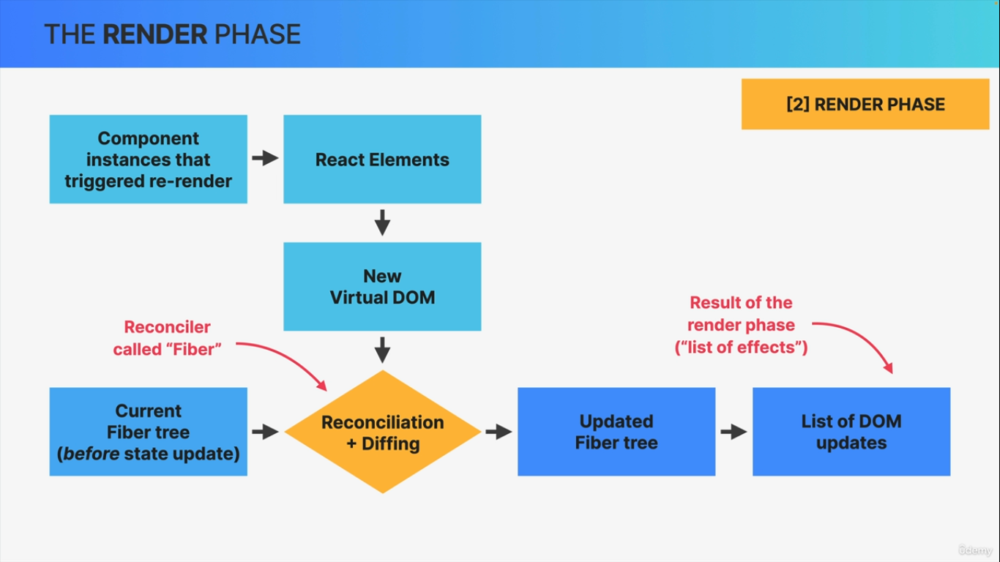
  - _VIRTUAL DOM_
    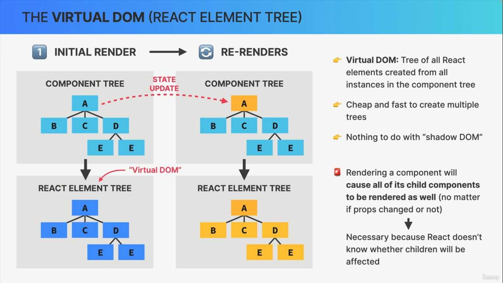
  - _RECONCILIATION_
    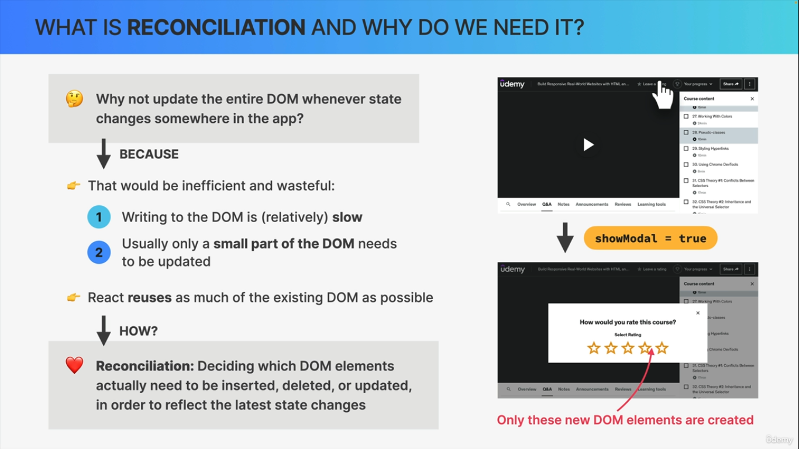
  - _RECONCILIATION : FIBER_
    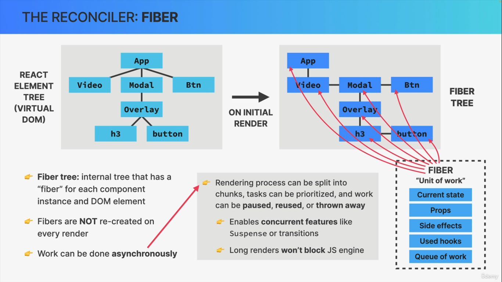
  - _RECONCILIATION IN ACTION_
    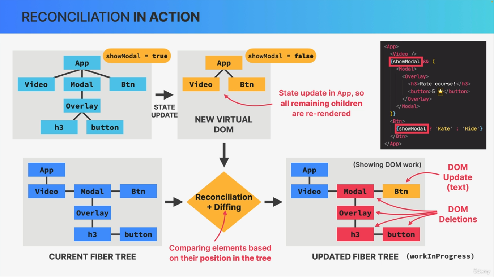
  - _DIFFING_
    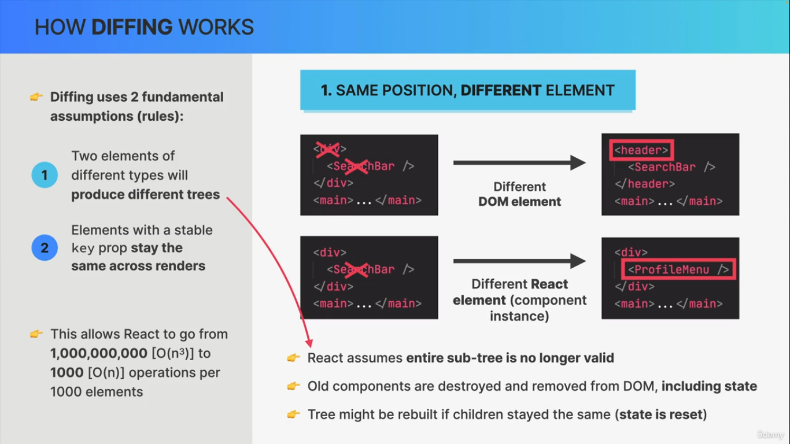

- **THE COMMIT PHASE & BROWSER PAINTS**
  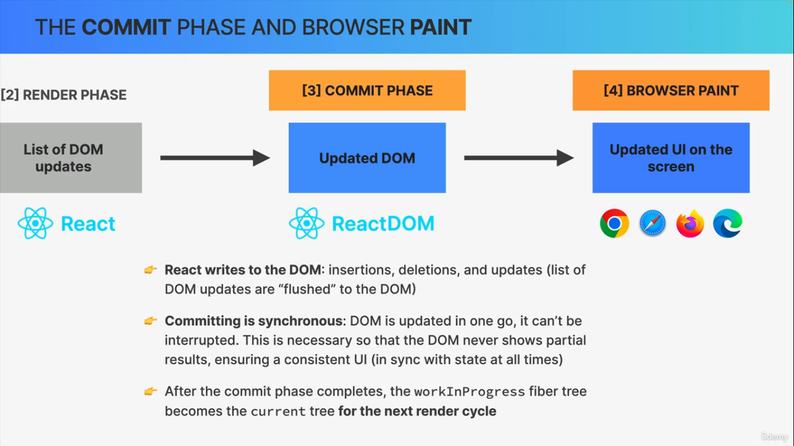
  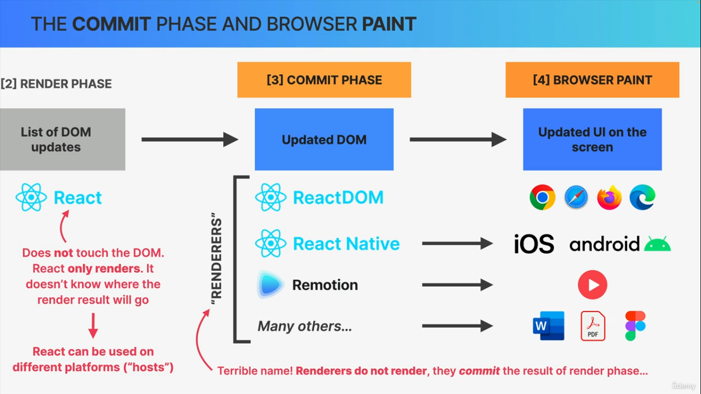

- SUMMARY OF HOW RENDERING WORKS
  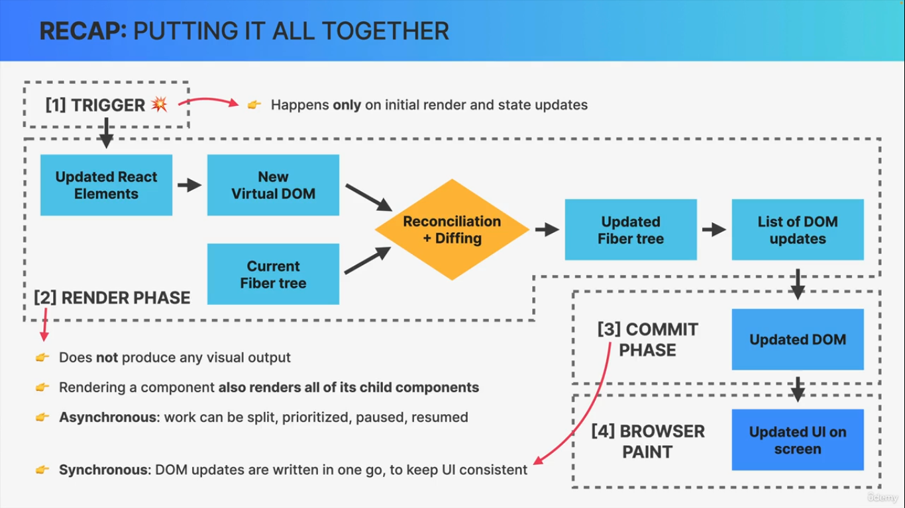

> ### KEY PROP IN COMPONENT

- `<Item key={index} />`
- To uniquely identify each component
- If component have state giving it `key prop` will make independent of other instances like state will isolate.

> ### RULES FOR RENDER LOGIC

- Components must be pure when it comes to render logic: given the same props(input), a component instance should always return the same JSX (output).

- Render logic must produce no side effects: no interaction with the "outside world" is allowed. So, in render logic:
  - DO NOT perform network request(API Calls)
  - DON NOT stat timers
  - DO NOT directly use the DOM API
  - DO NOT mutate objects or variables outside of the function scope
  - DO NOT update state(or refs): this will create an infinite loop!
- `Side effect are allowed (and encouraged) in event handler functions! There is also special hook to register side effects(useEffect)`

> ### BATCHING

- `Batching` is a performance optimization where multiple state updates are grouped into a single re-render. Instead of updating the UI every time a state setter is called, React waits until all code in an event handler or asynchronous block has finished before processing the changes.`In latest react versions, we get automatic batching at all times, everywhere.`

- Automatic batching can be problematic sometimes. Fot that `we can opt out of automatic batching by wrapping a state update in ReactDOM.flushSync().`(But you will never need this)

> ### LIBRARY vs FRAMEWORK

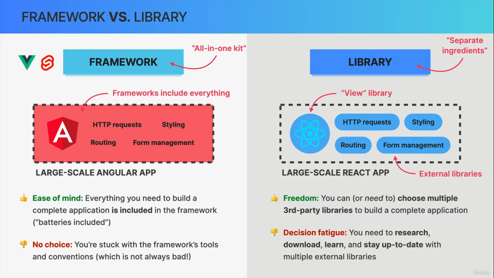

- React Third party libraries
  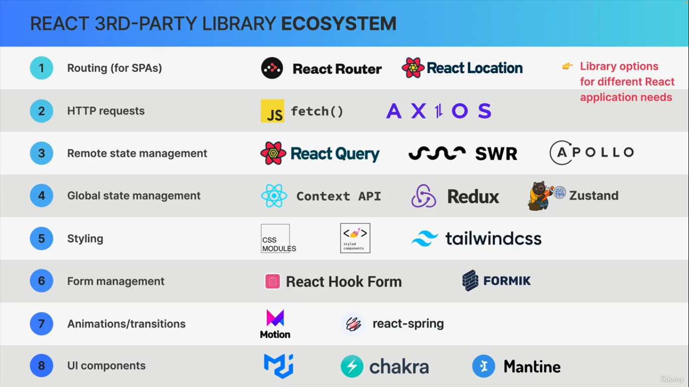

- React popular frameworks : NEXTjs, Remis, Gatsby

> ### SUMMARY
- A component is like a blueprint for a piece of UI that will eventually exist on the screen. When we “use” a component, React creates a component instance, which is like an actual physical manifestation of a component, containing props, state, and more. A component instance, when rendered, will return a React element.

- “Rendering” only means calling component functions and calculating what DOM elements need to be inserted, deleted, or updated. It has nothing to do with writing to the DOM. Therefore, each time a component instance is rendered and re-rendered, the function is called again.

- Only the initial app render and state updates can cause a render, which happens for the entire application, not just one single component.

- When a component instance gets re-rendered, all its children will get re-rendered as well. This doesn’t mean that all children will get updated in the DOM, thanks to reconciliation, which checks which elements have actually changed between two renders. But all this re-rendering can still 
have an impact on performance.

- Diffing is how React decides which DOM elements need to be added or modified. If, between renders, a certain React element stays at the same position in the element tree, the corresponding DOM element and component state will stay the same. If the element changed to a different position, or if it’s a different element type, the DOM element and state will be destroyed.

- Giving elements a key prop allows React to distinguish between multiple component instances. When a key stays the same across renders, the element is kept in the DOM. This is why we need to use keys in lists. When we change the key between renders, the DOM element will be destroyed and rebuilt. We use this as a trick to reset state.

- Never declare a new component inside another component! Doing so will re-create the nested component every time the parent component re-renders. React will always see the nested component as new, and therefore reset its state each time the parent state is updated.

- The logic that produces JSX output for a component instance (“render logic”) is not allowed to produce any side effects: no API calls, no timers, no object or variable mutations, no state updates. Side effects are allowed in event handlers and useEffect.

- The DOM is updated in the commit phase, but not by React, but by a “renderer” called ReactDOM. That’s why we always need to include both libraries in a React web app project. We can use other renderers to use React on different platforms, for example to build mobile or native apps 

- Multiple state updates inside an event handler function are batched, so they happen all at once, causing only one re-render. This means we can not access a state variable immediately after updating it: state updates are asynchronous. Since React 18, batching also happens in timeouts, promises, and native event handlers. 

- When using events in event handlers, we get access to a synthetic event object, not the browser’s native object, so that events work the same way across all browsers. The difference is that most synthetic events bubble, including focus, blur, and change, which do not bubble as native browser events. Only the scroll event does not bubble 

- React is a library, not a framework. This means that you can assemble your application using your favorite third-party libraries. The downside is that you need to find and learn all these additional libraries.


> ### END
