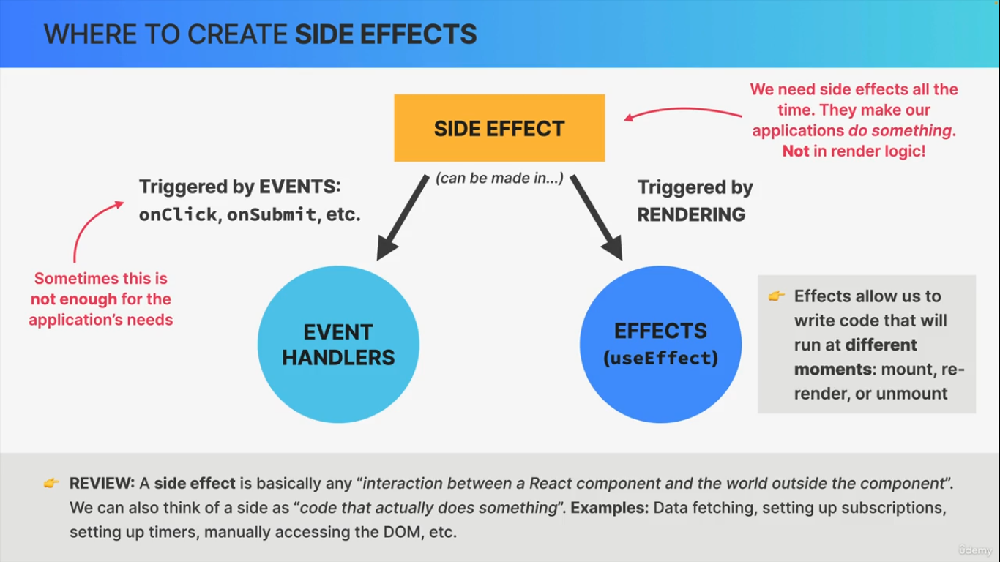
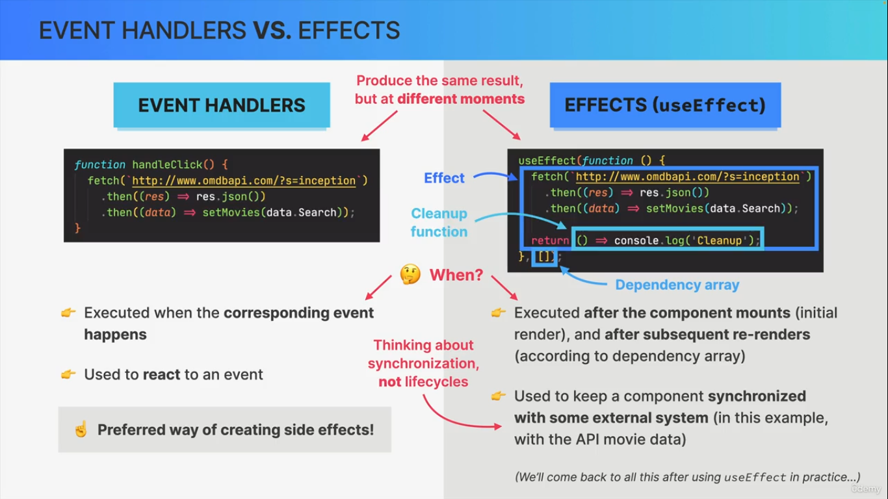

bh> # useEffect and Data Fetching

> ## TABLE OF CONTENTS

- useEffect
  - _About, use cases, syntx, how to use etc_
- Useful API for learning useEffect and datafetching
- useEffect vs useLayoutEffect
- Cleanup function in useEffect

> ## useEffect

- `useEffect` Hook is used to synchronize a component with external systems—those not controlled by React—and to handle side effects that cannot be performed during the initial rendering process.

> ## COMMONLY USED FOR

- `Data Fetching`: Initiating API calls to load data once a component appears on the screen.

- `Subscriptions`: Setting up WebSockets, Firebase listeners, or event listeners (e.g., window.addEventListener).

- `Timers`: Initializing and managing setTimeout or setInterval.

- `Direct DOM Manipulation`: Manually updating the DOM or interacting with non-React widgets (like a jQuery plugin or Google Maps).

> ## HOW TO USE

- By default, effects run after every render. We can prevent that by passing a dependency array

- Without the dependency array, React doesn’t know when to run the effect

- Each time one of the dependencies changes, the effect will be executed again

- Every state variable and prop used inside the effect must be included in the dependency array. otherwise, we get a 'stale closure'.

`SYNTAX : useEffect(<function>, <dependency>)`

- `No dependency passed.`
  - `useEffect(fn)`
    - Effect synchronizes with everything
    - Runs on every render

- `An empty array(Only run the effect on the initial render).`
  - `useEffect(fn,[])`
    - Effect synchronized with no state/props
    - Runs only on mount (initial render)

- `Props or state values.`
  - `useEffect(fn,[x,y,z])`
    - Effect synchronized with x,y and z
    - Runs on mount and re-renders triggered by updating z,y or z(Simply whenever any dependency value changes)

- Don't use async function directly in useEffect. Use callbackFn for it.

  ```jsx
    function App(){
      useEffect(()=>{
        async function() {
          // fetch logic
        }
      },[])
      return (
        <h1>Async operation</h1>
      )
    }
  ```

- `Each effect should do only one thing! Use one useEffect hook for each side effect.`

> ## EXAMPLES

Here is an example of a useEffect Hook that is dependent on a variable. If the count variable updates, the effect will run again:

```jsx
    import { useState, useEffect } from 'react';

    function Counter() {
     const [count, setCount] = useState(0);
     const [calculation, setCalculation] = useState(0);

     useEffect(() => {
            setCalculation(() => count \* 2);
     }, [count]); // <- add the count variable here

    return (
     <>
        <p>Count: {count}</p>
        <button onClick={() => setCount((c) => c + 1)}>+</button>
        <p>Calculation: {calculation}</p>
     </>
     );
    }
```

> ## Where to create sideEffects

- 

> ### Events Handlers vs Effects

- 

> ## useEffect vs useLayoutEffect

- useLayoutEffect is another type of effect
- Main differnce between them is
  - `useEffect` runs after browser paints the screen
  - `useLayoutEffect` runs before the browser paints the screen

> ## useEffect to change page title

```jsx
function App() {
  useEffect(
    function () {
      document.title = "hello";
    },
    [tab],
  );
  // whenever tab changes change page title
  return <h1>changing title</h1>;
}
```

> ## Cleanup function in useEffect

The cleanup function in useEffect is a way to clean up side effects before the component unmounts or before the effect runs again.

Why Needed

- Necessary whenever the side effect keeps happening after the component has been re-rendered or unmounted.
  - Example : HTTP request(Effect) &rarr; Cancel request(Cleanup)

`syntx`

```jsx
import { useEffect } from "react";

useEffect(() => {
  // side effect code

  return () => {
    // cleanup code
  };
}, [dependencies]);
```

> ## useful API

- omdbapi.com

> ## END
