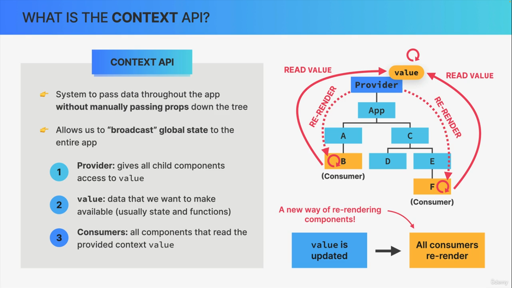

> # CONTEXT API

> ## What is context api?



The **Context API** in React is a way to share data across components **without passing props manually at every level** (aka “prop drilling”).

Think of it as a **global data store (but lightweight)** for a part of your component tree.

Instead of:

```
App → Parent → Child → DeepChild
```

passing props through every level…

Context lets **DeepChild access data directly**, skipping intermediates.

> Key Concepts Summary

- `createContext()` → creates context
- `Provider` → wraps components and provides data
- `useContext()` → consumes data

---

> Quick Mental Model

- Context = “Broadcast data to all children without passing props manually”

> ## WHEN TO USE ?

Use Context API when:

- You have **global-like data**, such as:
  - Theme (dark/light)
  - Logged-in user info
  - Language settings

- Props are being passed through **many layers unnecessarily**
- Multiple components need the **same data**

> ## AVOID USING IT FOR :

- Frequently changing data (can cause re-renders)
- Complex state logic → use Redux/Zustand instead

> ## Problem (Without Context API)

```jsx
// Prop Drilling Example
function App() {
  const user = "AR";
  return <Parent user={user} />;
}

function Parent({ user }) {
  return <Child user={user} />;
}

function Child({ user }) {
  return <DeepChild user={user} />;
}

function DeepChild({ user }) {
  return <h1>Hello {user}</h1>;
}
```

**Problems:**

- Passing `user` through every component
- Hard to maintain
- Unnecessary coupling


> ## Solution (Using Context API)


### Step 1: Create Context

```jsx
import { createContext } from "react";

export const UserContext = createContext();
```

### Step 2: Provide Context

```jsx
import { UserContext } from "./UserContext";

function App() {
  const user = "AR";

    // Values are passed as object in provider

  return (
    <UserContext.Provider value={user}>
      <Parent />
    </UserContext.Provider>
  );
}
```

### Step 3: Consume Context

```jsx
import { useContext } from "react"; // useContext helps to read value from provider
import { UserContext } from "./UserContext";

function DeepChild() {
    /* If many (object) values then we can destructure(get what we want) 
    
    const { user, otherData } = useContext(UserContext);
    */

  const user = useContext(UserContext);
  return <h1>Hello {user}</h1>;
}
```

> ## What problem did Context API solve?

### Before:

- Props passed through every layer
- Components tightly coupled
- Hard to refactor

### After:

- Direct access to shared data
- Cleaner components
- Easier scaling

> ## Real-world Example (Theme Toggle)

```jsx
const ThemeContext = createContext();

function App() {
  const [theme, setTheme] = useState("light");

  return (
    <ThemeContext.Provider value={{ theme, setTheme }}>
      <Page />
    </ThemeContext.Provider>
  );
}

function Button() {
  const { theme, setTheme } = useContext(ThemeContext);

  return (
    <button onClick={() => setTheme(theme === "light" ? "dark" : "light")}>
      Current: {theme}
    </button>
  );
}
```

> ## END
