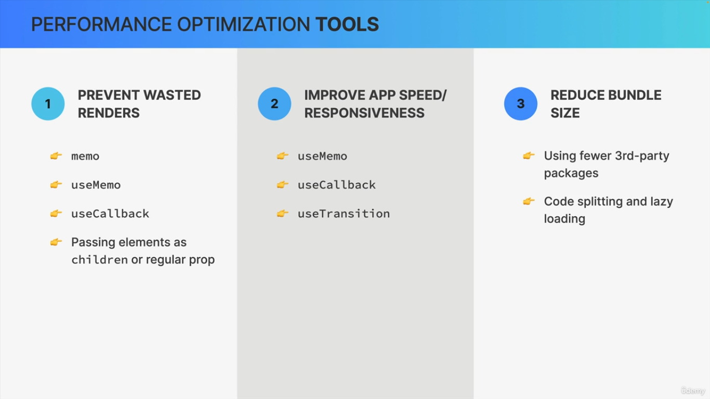
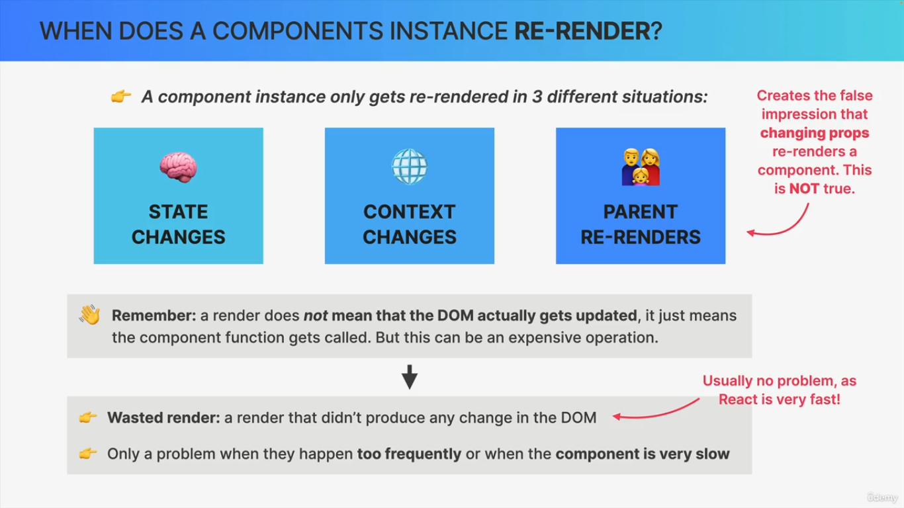
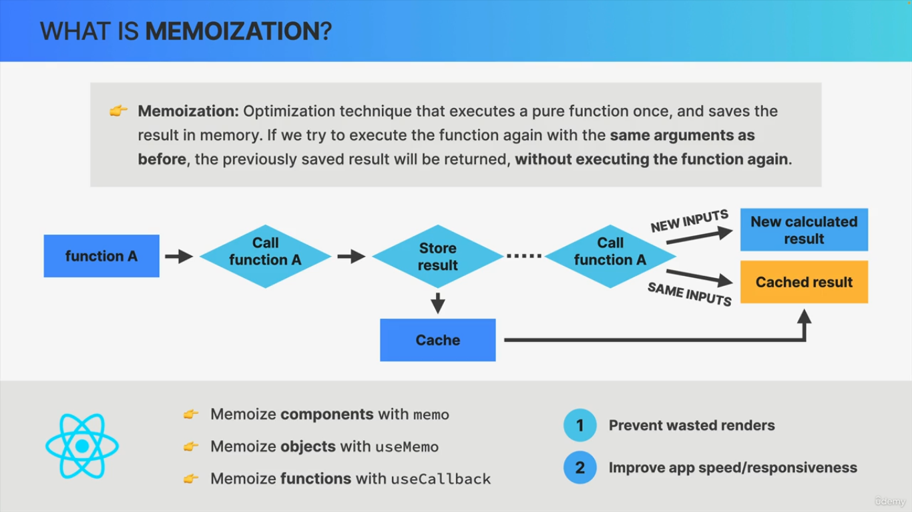
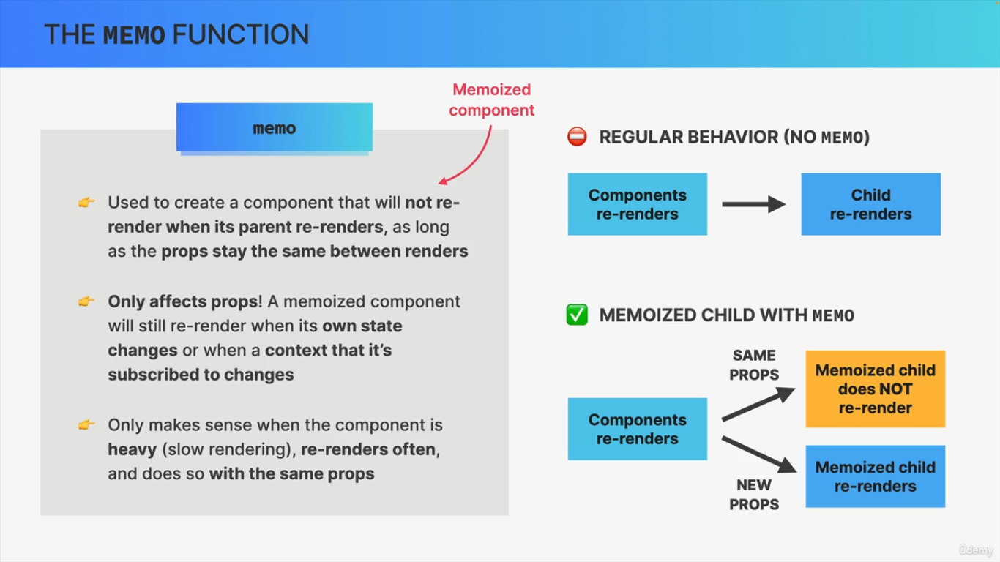
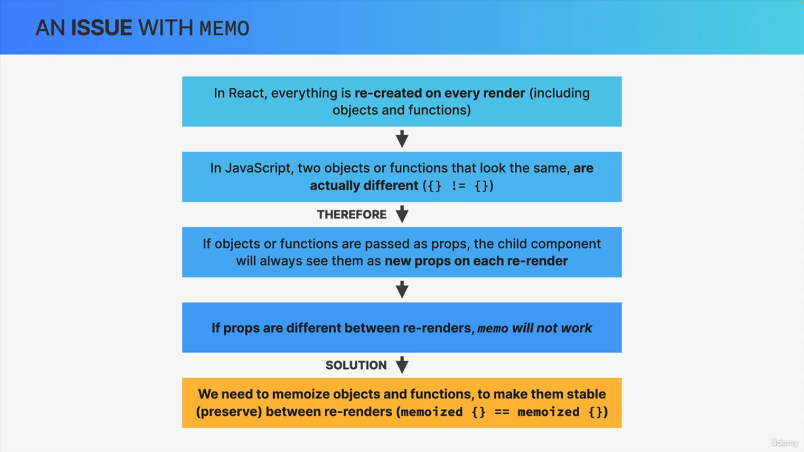
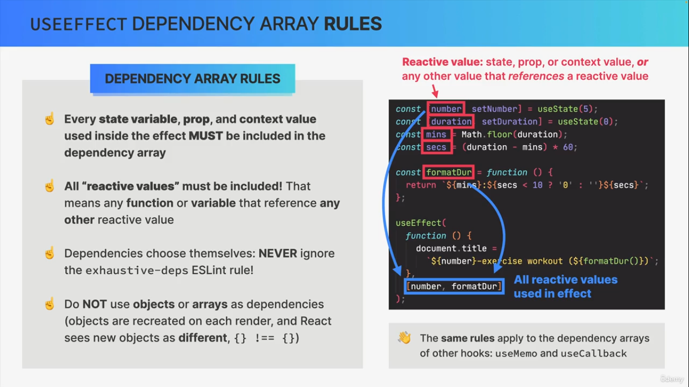
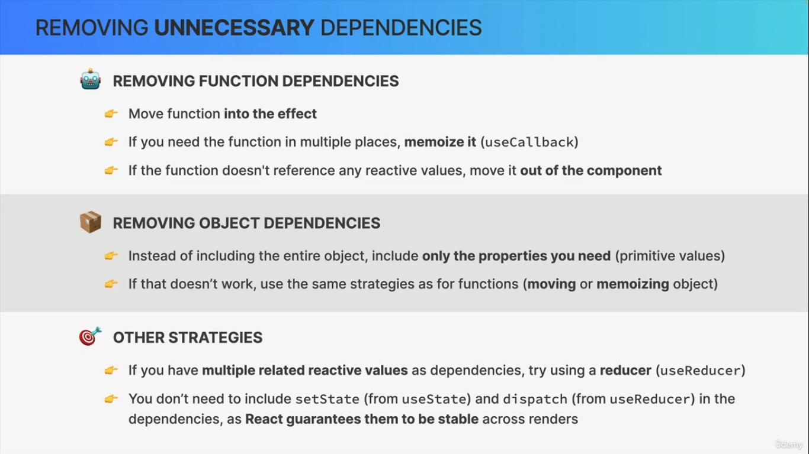
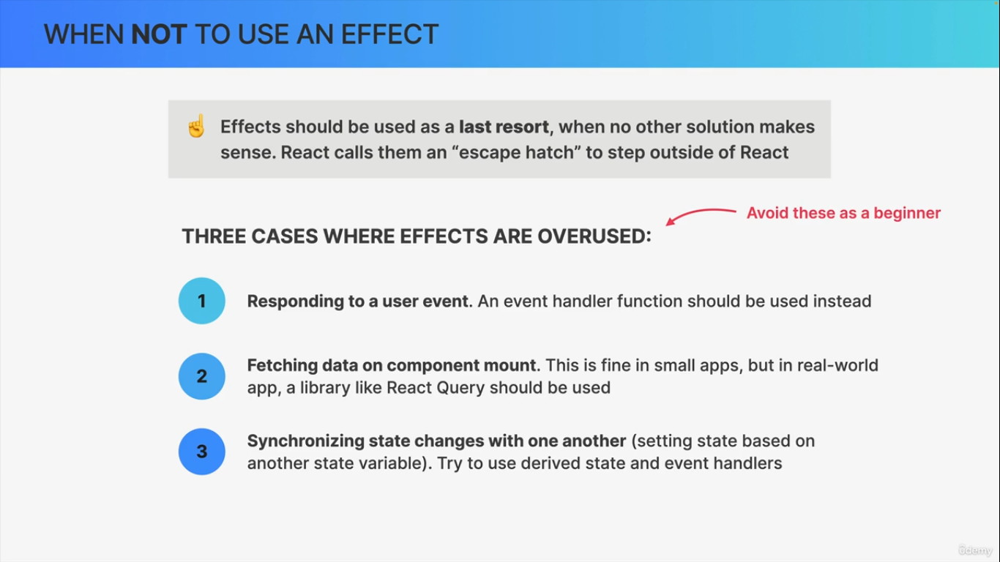

> # Performance Optimization and Advanced useEffect

> ## SYLLABUS

- memo function
- useMemo()
- useCallBack()
- Advanced useEffect concept
- Closures in effect

> ## Memo function

- 

- 

- `USING REACT-DEV-TOOLS (PROFILER DEVELOPER TOOLS) : To see which which compoents re-renders when state changes or parents re-renders. Check video no. 3`

- > `Using Children to optimize performance.` use ChatGPT

- 

- 

> ## EXAMPLE : memo

React.memo() is used to prevent unnecessary re-renders of components by memoizing the result. It works like a performance optimization wrapper for functional components.

`SYNTAX`

```js
const MemoizedComponent = React.memo(Component);
```

```js
// or directly
const MyComponent = React.memo((props) => {
  return <div>{props.value}</div>;
});
```

```jsx
import React, { useState } from "react";

const Child = React.memo(({ name }) => {
  console.log("Child rendered");
  return <h2>Hello {name}</h2>;
});

function Parent() {
  const [count, setCount] = useState(0);

  return (
    <div>
      <h1>Count: {count}</h1>
      <button onClick={() => setCount(count + 1)}>Increase</button>
      <Child name="AR" />
    </div>
  );
}

export default Parent;

/*
Clicking Increase updates count
Parent re-renders
BUT Child does NOT re-render because props (name) didn’t change
*/
```

> ## Issue with memo

- 

> ## Solution for memo issue

- > `SOLUTION` : useMemo and useCallBack hooks
  - Used to memoize values (useMemo) and functions (useCallback) between renders.

  - Values passed into useMemo and useCallBack will be stored in memory (“cached”) and returned in subsequent re-renders, as long as dependencies("inputs") stay the same.

  - useMemo and useCallBack have a dependency arrays (like useEffect): whenever one dependency changes, the value will be re-created.

  - Use them for one of the 3 use cases
    - Memoizing props to prevent wasted renders (together with memo)

    - Memoizing values to avoid expensive re-calculations on every render.

    - Memoizing values that are used in dependency array of another hook.

> ## Example showing useMemo()

`syntax : useMemo(callBackFn,[dependencyArray])`

`Main purpose of useMemo() is to Memoizes a value.`

```js
const memoizedValue = useMemo(() => {
  // expensive calculation
  return result;
}, [dependencies]);
```

### Without useMemo() (recalculates every render)

```jsx
function App({ num }) {
  const squared = num * num; // runs every render

  return <h1>{squared}</h1>;
}
```

### With useMemo() (optimized)

```jsx
import { useMemo } from "react";

function App({ num }) {
  const squared = useMemo(() => {
    console.log("Calculating...");
    return num * num;
  }, [num]);

  return <h1>{squared}</h1>;
}
// Now it only recalculates when num changes.
```

> ## Example showing useCallBack()

`Syntax : useCallBack(callBackFn, [dependency])`

`Main purpose of useCallBack() is to Memoizes a function`

```js
const memoizedCallback = useCallback(() => {
  // function logic
}, [dependencies]);

/* First argument: function you want to memoize
Second argument: dependency array
React will return the same function reference unless dependencies change */
```

```jsx
import React, { useState, useCallback } from "react";

function Counter() {
  const [count, setCount] = useState(0);

  const increment = useCallback(() => {
    setCount((prev) => prev + 1);
  }, []); // no dependencies

  return (
    <div>
      <p>Count: {count}</p>
      <button onClick={increment}>Increment</button>
    </div>
  );
}

export default Counter;

// Here, increment will not be recreated on every render.
```

> ## Optimizing Bundle size with code splitting

- `Bundle`: JavaScript file containing the entire application code. Downloading the bundle will load the entire app at once, turning it into a SPA.

- `Bundle size`: Amount of JavaScript users have to download to start using the app. One of the most
  important things to be optimized, so that the bundle takes less time to download.

- `Code splitting`: Splitting bundle into multiple parts that can be downloaded over time (“lazy loading”).

- > Desmonstrate using Suspense, lazy(lazyloading)

> ## When to optimize and when not to optimize

`DO`

- Find performance bottlenecks using the Profiler and visual inspection (laggy UI)
- Fix those real performance issues
- Memoize expensive re-renders
- Memoize expensive calculations
- Optimize context if it has many consumers and changes often
- Memoize context value + child components
- Implement code splitting + lazy loading for SPA routes

`DON’T!`

- Don’t optimize prematurely!
- Don’t optimize anything if there is nothing to optimize...
- Don’t wrap all components in memo()
- Don’t wrap all values in useMemo()
- Don’t wrap all functions in useCallback()
- Don’t optimize context if it’s not slow and doesn’t have many consumers

> ## Advanced useEffect concept

- 

- 

- 


> ## END
