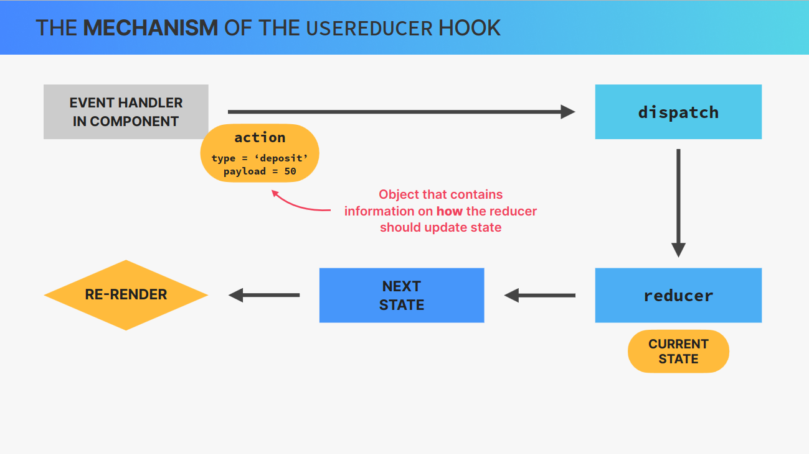
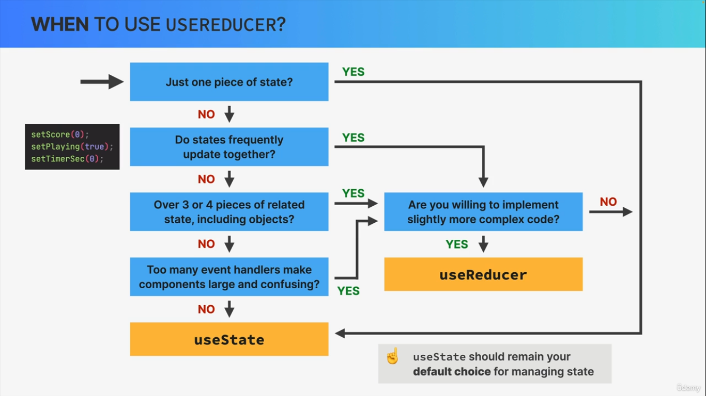

> # useReducer Hook

- It’s a hook for managing state using a reducer function.

- Instead of directly setting state, you:
  - dispatch actions
  - and a reducer decides how state changes

- USEFUL WHEN
  - complex state handling

> ### SYNTAX

`const [state, dispatch] = useReducer(reducer, initialState);`

**Parameters:**

- **reducer** &rarr; function that handles state logic and `returns next state. And must always return state`. Must be pure function(no side effects). `reducer(state, action)`

- **initialState** &rarr; starting value.

Returns:

- **state** &rarr; current state

- **dispatch** &rarr; function to trigger state updaates, by sending actions from event handlers to the reducer. `dispatch(action)`. Action is usually object that describes how to update the state similar to this format `{type: "increment", payload: 1}` and this is common standard/practice.

> ### Mechanism of useReducer hook

- 

- `Dispatch an action using event handler in component` &rarr; `Dispatch takes that action to the reducer function` &rarr; `reducer function updates state using action(type and payload)` &rarr; `Returns next state (always)` &rarr; `Re-render`

> ### Example 1 : Counter

```jsx
import React, { useReducer } from "react";

// Step 1: Define initial state
const initialState = { count: 0 }; // object or just value, count is single piece of state

// Step 2: Create reducer function which has state and action
// (handles how state changes based on action)
function reducer(state, action) {
  switch (action.type) {
    case "increment":
      return { count: state.count + 1 }; // whatever it returns becomes next state and same for others
    case "decrement":
      return { count: state.count - 1 };
    case "reset":
      return initialState;
    default:
      return state; // We usually return state or throw error : Simply state won't be updated/remains same
  }
}

export default function Counter() {
  // Step 3: Call useReducer inside component
  // (connects reducer + initial state)
  const [state, dispatch] = useReducer(reducer, initialState);

  // Step 4: Dispatch actions
  // Step 5: Access state

  return (
    <div>
      <h2>Count: {state.count}</h2>
      <button onClick={() => dispatch({ type: "increment" })}>+</button>
      <button onClick={() => dispatch({ type: "decrement" })}>-</button>
      <button onClick={() => dispatch({ type: "reset" })}>Reset</button>
    </div>
  );
}
```

> ### Example 2 : Data fetching

```jsx
import React, { useReducer, useEffect } from "react";

const fetchReducer = (state, action) => {
  switch (action.type) {
    case "FETCH_START":
      return { ...state, loading: true, error: null };
    case "FETCH_SUCCESS":
      return { loading: false, data: action.payload, error: null };
    case "FETCH_ERROR":
      return { loading: false, data: null, error: action.payload };
    default:
      return state;
  }
};

const AutoDataFetcher = () => {
  const [state, dispatch] = useReducer(fetchReducer, {
    data: null,
    loading: true,
    error: null,
  });
// data, loading, error are pieces of states, remember how we had to make different states for these using useState like one state for data, another for loading, and other for error handling. Because of useReducer hook we can have all these related pieces of state at one place and we can update them easily.
  useEffect(() => {
    const fetchData = async () => {
      dispatch({ type: "FETCH_START" });

      try {
        const response = await fetch(
          "https://jsonplaceholder.typicode.com/posts",
        );
        const result = await response.json();
        dispatch({ type: "FETCH_SUCCESS", payload: result });
      } catch (err) {
        dispatch({ type: "FETCH_ERROR", payload: err.message });
      }
    };

    fetchData();
  }, []); // Empty dependency array = run once on mount

  const { data, loading, error } = state;

  if (loading) return <div>Loading...</div>;
  if (error) return <div>Error: {error}</div>;

  return (
    <div>
      <h2>Posts</h2>
      <ul>
        {data &&
          data.map((post) => (
            <li key={post.id}>
              <strong>{post.title}</strong>
              <p>{post.body}</p>
            </li>
          ))}
      </ul>
    </div>
  );
};

export default AutoDataFetcher;
```

> ## USESTATE VS USEREDUCER

- useState is ideal for single, independent pieces of state(numbers, strings, single arrays, etc) **Whereas** useReducer is ideal for multiple related pieces of state and complex state(eg. object with many values and nested objects or arrays)

- In useState, Logic to update state is placed directly in event handlers or effects, spread all over one or multiple components. **Whereas** In useReducer, Logic to update state lives in one central place, decoupled from components: the reducer.

- In useState, state is updated by calling setState **Whereas** in useReducer, state is updated by dispatching an action to a reducer.

> ## WHEN TO USE USEREDUCER HOOK



> ## END
