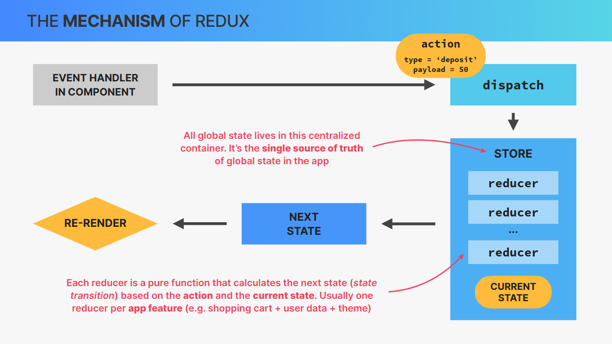
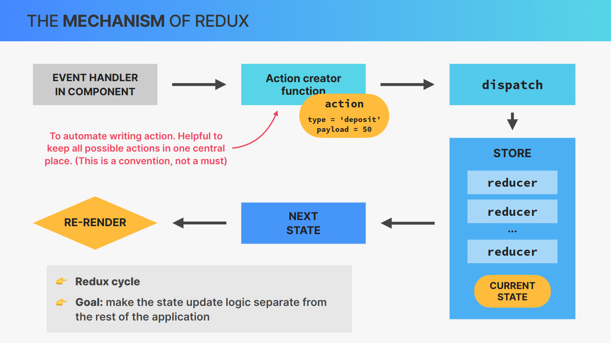

> # REDUX

> TABLE OF CONTENTS

- INSTALATION
- REDUX
- REDUX MECHANISM
- REDUX MIDDLEWARE

> ## INSTALLATION

- ```bash
    npm i redux react-redux

    # redux : for redux

    # react-redux : for using dispatch anywhere in the app by using useDispatch() which return function to dispatch. By wrapping app component Provider, which comes from react-redux. Also gives useSelector() for reading state. useDispatch and useSelector are modern way of connecting redux with component.
  ```

> ## REDUX

- 3rd-party library to manage `global state`.

- `Standalone library`, but easy to integrate with React apps using react-redux library.

- All global state is `stored in one globally accessible store`, which is easy to update using “actions” (like useReducer).

- It’s conceptually similar to using the `Context API + useReducer`.

- Two “versions”: (1) `Classic Redux`, (2) `Modern Redux Toolkit`.

- `Globa store is updated` &rarr; `All consuming components re-render`.

> DO WE NEED TO LEARN REDUX?

- Historically, Redux was used in most React apps for all global state. Today, that has changed, because there are many alternatives. Many apps don’t need Redux anymore, unless they need a lot of global UI state.

- WHY LEARN REDUX?
  - You will encounter Redux code in your job, so you should understand it.
  - Some apps do require Redux (or a similar library).

> REDUX USE CASES

- FOR `UI STATE` : Redux &rarr; Ideal use case for redux, when there is lots of state that updates frequently.
  - **ALTERNATIVE** : Context API + useState/useReducer, Zustand, Recoil

- FOR `REMOTE STATE` : RTK Query &rarr; API calls using Thunk.
  - **ALTERNATIVE** : Context API + useState/useReducer, Zustand, Recoil, React Query, SWR etc

> ## MECHANISHM OF REDUX

- 

- 

> ## Example : REDUX(Classic redux)

```js
// store.js
import { createStore } from "redux";

/* STEP 1 : CREATE INITIAL STATE */
/* Here each key are individual states, if we have used useState, we could have created state for balance, state for loan, state for loanPurpose all separately. */
const initialState = {
  balance: 0,
  loan: 0,
  loanPurpose: "",
};

/* STEP 2 : DEFINE REDUCER FUNCTION */
/* Reducer are not allowed to modify the existing state directly, no any async logic, or any other side effects 

Here in this reducer we directly pass initalState as default state/value.

Back in those days, we used to write action types all in uppercase like SET_BALANCE, DEPOSIT_ACCOUNT etc 

But now a days, it is convention to write in the shape of domain/eventName. Example : account/deposit, account/withdraw, account/loan etc

We usually use switch statement.

We can give reducer function any name like AccountReducer instead of reducer

We can have multiple reducer functions based on their purpose. And therfore multiple initialStates.
*/
function reducer(state = initialState, action) {
  switch (action.type) {
    case "account/deposit":
      return {
        ...state,
        balance: state.balance + action.payload,
      };
    case "account/withdraw":
      return {
        ...state,
        balance: state.balance - action.payload,
      };
    case "account/requestLoan":
      if (state.loan > 0) return state;
      return {
        ...state,
        loan: action.payload.amount,
        loanPurpose: action.payload.purpose,
        balance: state.balance + action.payload.amount,
      };
    case "account/payLoan":
      return {
        ...state,
        loan: 0,
        loanPurpose: "",
        balance: state.balance - state.loan,
      };
    default:
      return state;
    // In default case, it is recommended to just return the original state. In case if react don't know what to do then it will just return the state. Nothing will be updated.
  }
}

/* STEP 3 : CREATE STORE */
/* createStore method is now depreciated and not used */

/*
call createStore function with reducer and it return store which we save in store variable.

if we have multiple reducers then import combineReducer function then add then there that accepts object and add values in key value form.Example

const rootReducer = combineReducers({
  account: accountReducer,
  customer: customerReducer
})

then use in createStore
const store = createStore(rootReducer);

*/
const store = createStore(reducer);

/* dispatch to send action */
store.dispatch({
  type: "account/deposit",
  payload: 500,
});
store.dispatch({
  type: "action/requestLoan",
  payload: { amount: 1000, purpose: "Buy laptop" },
});

/* STEP 4 : TO RUN IMPORT THIS FILE IN INDEX.JS FILE, we don't need to export this current file. This is for running only */

/* STEP 5 */
console.log(store.getStore());
```

> ## EXAMPLE : using action creators

- We usually do not maually create type. We do such that using action creators. Not necessary(works without this.) but it is a convention.

- For this we create function for each action.

```js
// store.js
import { createStore } from "redux";

/* STEP 1 : CREATE INITIAL STATE */
const initialState = {
  balance: 0,
  loan: 0,
  loanPurpose: "",
};

/* STEP 2 : DEFINE REDUCER FUNCTION */
function reducer(state = initialState, action) {
  switch (action.type) {
    case "account/deposit":
      return {
        ...state,
        balance: state.balance + action.payload,
      };
    case "account/withdraw":
      return {
        ...state,
        balance: state.balance - action.payload,
      };
    case "account/requestLoan":
      if (state.loan > 0) return state;
      return {
        ...state,
        loan: action.payload.amount,
        loanPurpose: action.payload.purpose,
        balance: state.balance + action.payload.amount,
      };
    case "account/payLoan":
      return {
        ...state,
        loan: 0,
        loanPurpose: "",
        balance: state.balance - state.loan,
      };
    default:
      return state;
  }
}

/* STEP 3 : CREATE STORE */
const store = createStore(reducer);


/* STEP 4 : CREATE ACTION CREATORS functions */
function deposit(amount) {
  return { type: "account/deposit", payload: amount };
}

function withdraw(amount) {
  return { type: "account/withdraw", payload: amount };
}

function requestLoan(amount, purpose) {
  return {
  type: "action/requestLoan",
  payload: { amount, purpose },
}
}

function payLoan() {
  return {
    type: "account/payLoan"
  }
}

/* DISPATCH ACTIONS */
store.dispatch(deposit(500));
console.log(store.getState());

store.dispatch(requestLoan(1000, "Buy new laptop"));
console.log(store.getState());

```

> ## FOLDER STRUCTURE
```js
/*
store.js

import that reducer function here and add to the store

also export this store using default export in order to use it in index.js file top level file.
*/


/* 
features/account/accountSlice.js

Add InitalState, actionCreators functions, reducer function  

default export for reducer functions
name export for actions creators functions

SIMPLY : Different slice file for different reducers.
*/


/*
action creators are imported where we use them. We use them in component to dispatch action
*/

/*
index.js
import { Provider } from "react-redux";

Then wrap App component with this provider which accpets store. Example
<Provider store={store} >
  <App />
</Provider>
*/

```

> ## EXAMPLE
Example showing using of classic redux, in proper folder structure

> legacy way of connecting redux with component

> ## END
